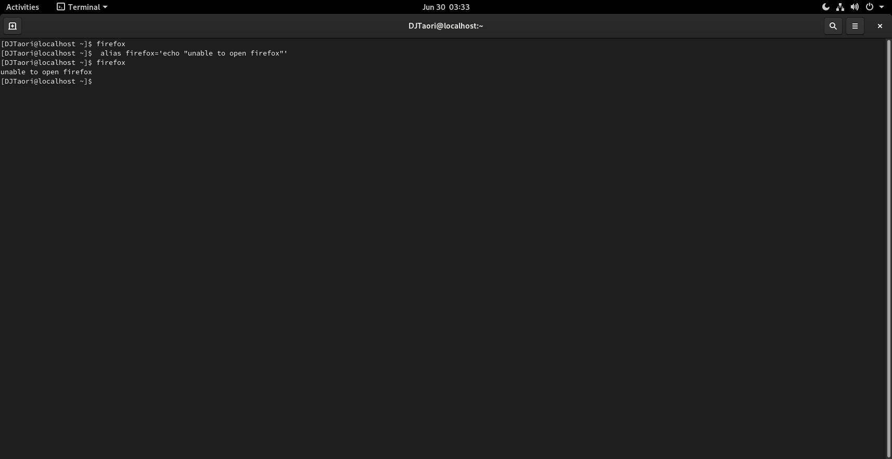

## *************Not sure about the answer, still looking!***********

# Problem #1   
## Block System call : 

### i)block system call for date command ; that means you don't have to uninstall date command but if you run, kernel must not accept.
#### Answer:
```
date 
```
>> this command will give us exact date & time in terminal through CLI method.
```
 alias date='echo "unable to display date"'
```
>> this command when passed will just assign value of your wish to 'date'. Here we've given value "unable to display date".
>> 'alias' command is used to assign false identity to other commands or give some value to any name. It is used as 'alias Name=Value'.
>> 'echo' command is used to display text/string that are passed as arguements.
```
 date
 ```
```
unable to display date 
```
>>this message will appear


### ii)do the same Firefox as well
#### Answer:
 ```
 firefox 
```
>>firefox will open
```
 alias firefox='echo "unable to open firefox"'
```
>>given value will be assigned
```
 firefox
```
```
unable to open firefox 
```
>>this message will appear

