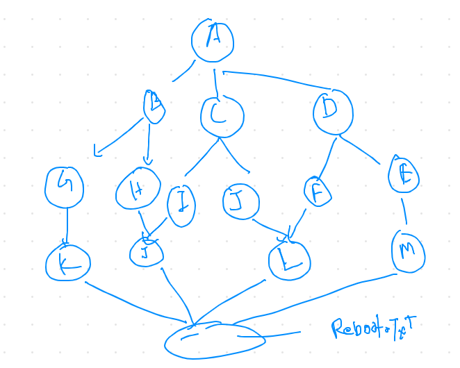
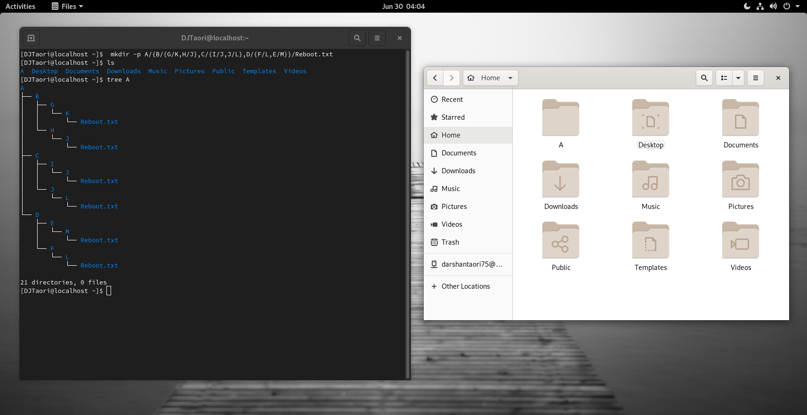

# Problem #3 
## Create a Directory Structure: 

Note :   You are only allowed to use a single command and only one time.



### Answer:

```
 mkdir -p A/{B/{G/K,H/J},C/{I/J,J/L},D/{F/L,E/M}}/Reboot.txt
```   
>> "mkdir" command is used to make directories which do not exist already.
>> '-p' is short for "paresnts", it is used for making parent directories as we want given that directory should not pre-exist and syntx are put in correct form.
>> Here, 'A' is most superior directory and many sub-directories and sub-sub-directories are made.
>> Reboot.txt is shared by all directories.

>>To check if we have made all directories correctly, we need to pass "Tree" command in terminal.
```
Tree A
```
  
