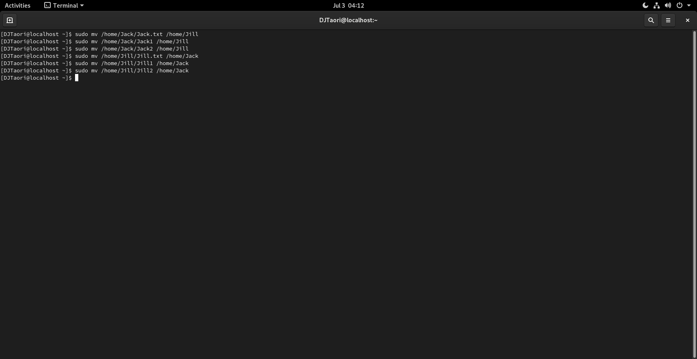
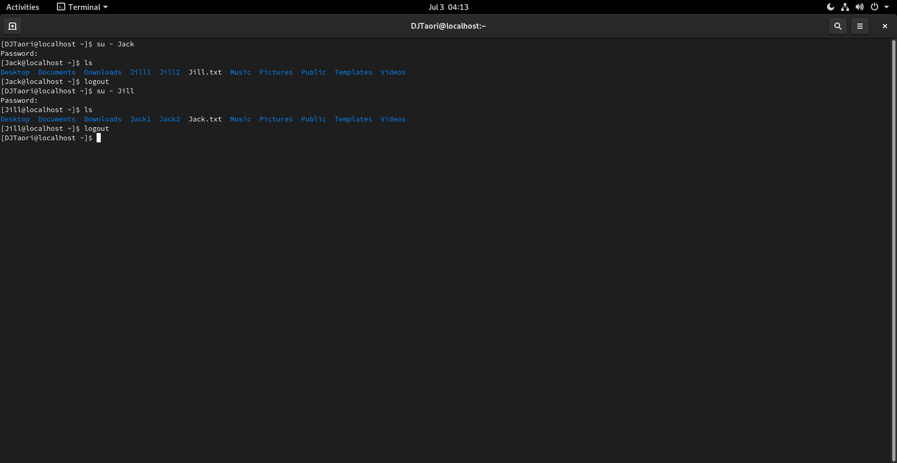

# Problem #4
## Share and files and folder 

* #### Create two users name Jack and Jill  from command line.
* #### Create all the data under home directory of each users.
* #### Login with Jack user and create a file name  Jack.txt using vim editor and write "hello jack".
* #### From jack user also create two directories name Jack1 & Jack2.
* #### Now login from Jill user and create a file. Jill.txt using vim editor and write "hey jill".
* #### From Jill also create two directoires named Jill1 & Jill2.
* #### Swap these files and directories in between users.
#### IMPORTANT : To swap don't use root account.

## Solutions:

### i) Create two users name Jack and Jill  from command line.
### Answer:
```
sudo useradd Jack
```
> New User 'Jack' is created.
```
sudo passwd Jack
```
> Password is set-up for the user.
```
sudo useradd Jill
```
> New User 'Jill' is created.
```
sudo passwd Jill
```
> Password is set-up for the user.


### ii) Login with Jack user and create a file named Jack.txt using vim editor and write "hello jack".
### Answer:
```
su - Jack -> Password:
```
> Logged into 'Jack'
```
vim Jack.txt
```
> File would be opened in vim. Now, press `i`(it will take you in Insert Mode) and then type `hello jack`. After that press `esc` and type `:wq` and press `enter`, it will save your file and will return to terminal.


### iii) From jack user also create two directories named Jack1 & Jack2.
### Answer:
```
mkdir Jack1 Jack2
```
`ls` (this will show you directories are made.)

`logout` (to logout of account 'Jack')


### iv) Now login from Jill user and create a file named Jill.txt using vim editor and write "hey jill".
### Answer:
```
su - Jill -> Password:
```
> Logged into 'Jill'
```
vim Jill.txt
```
>File would be opened in vim. Now, press `i`(it will take you in Insert Mode) and then type `hey jill`. After that press `esc` and type `:wq` and press `enter`, it will save your file and will return to terminal.


### v) From Jill also create two directoires named Jill1 & Jill2. 
### Answer:
```
mkdir Jill1 Jill2
```
`ls` (this will show you directories are made.)

`logout` (to logout of account 'Jill')


### vi) Swap these files and directories in between users.
To swap files and directories in between users, we need to move files and directories as per our need.
We have to move files and directories made in user 'Jack' to user 'Jill' and vice-versa.
For that we have to use `sudo mv` command.
```
sudo mv /home/Jack/Jack.txt /home/Jill
sudo mv /home/Jack/Jack1 /home/Jill
sudo mv /home/Jack/Jack2 /home/Jill

sudo mv /home/Jack/Jill.txt /home/Jack
sudo mv /home/Jack/Jill1 /home/Jack
sudo mv /home/Jack/Jill2 /home/Jack
```
> These command will swap files and directories we made as per our need without switching to root account(user).



Let's check if the files and directories are swapped correctly by terminal.
`su - Jack` (Switched to user 'Jack')

`ls` (files are swapped properly)

`logout`

`su - Jill` (Switched to user 'Jill')

`ls` (files are swapped properly)

`logout`



We can also check it graphically by switching into both the users.
