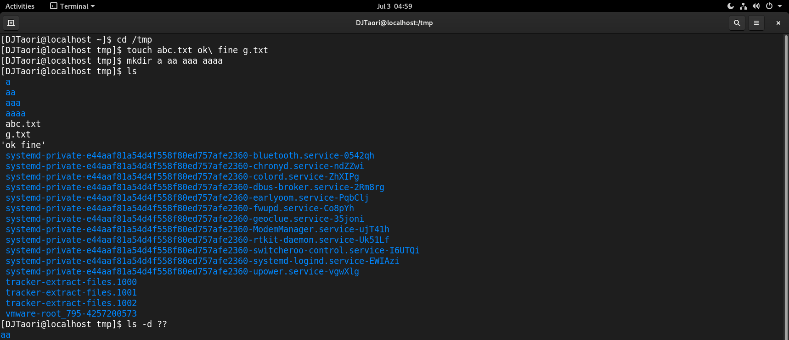

# Problem #5   
## Play with files and directories:

* #### Create 3 files named abc.txt ok fine g.txt under /tmp directory. 
* #### Create 4 directories a aa aaa aaaa  under  /tmp directory.
* #### Give ls command to list the content of /tmp directory and make sure it will only list the content (file|directory) having 2 char in their name.

### Answer:
```
cd /tmp
touch abc.txt ok\ fine g.txt
mkdir a aa aaa aaaa
ls 
ls -d ??
```
> 'touch' and 'mkdir' commands are used to create files and directories respectively.

> 'ls' command that lists directory contents of files and directories.

> 'ls -d' lists files and directories with name of particular length (`ls -d ??` is used to find a file with name having 2 characters).



