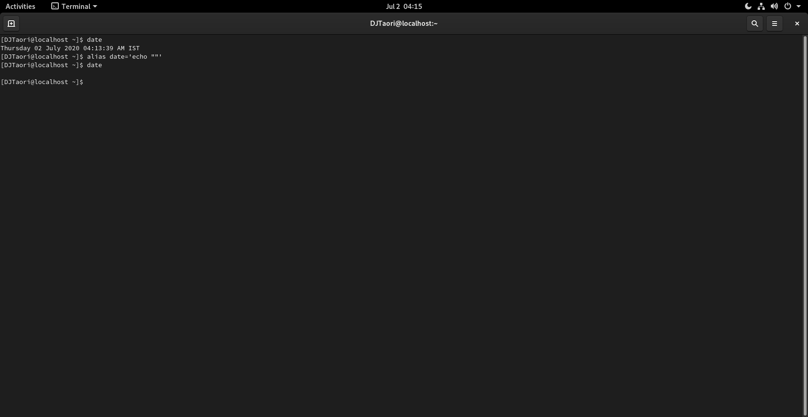

# Problem #6
## Run command without any Output: 

* #### Open terminal and type any command 
* #### Once you press enter, your output of given command must not print.
* #### You are not allowed to redirect output anywhere.
### Answer:
 `date` ->It will show you date & time.
 ```
 alias date='echo "" '
 ```
 now give 'date' command again:
 ```
 date
 ```
 ### `NO OUTPUT`
 
 
 
